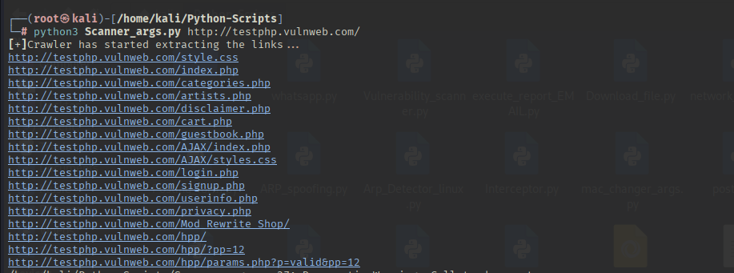
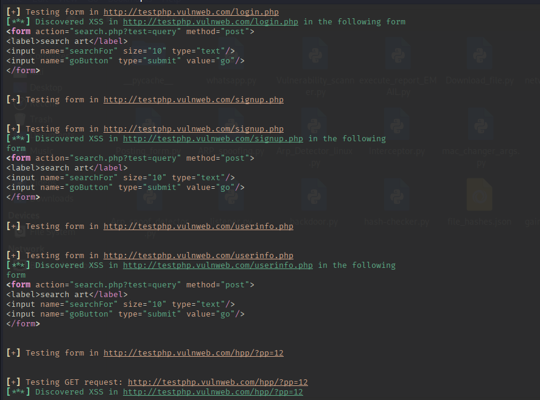

# 🛡️ XSS Scanner (Python)

A Python-based **Cross-Site Scripting (XSS) vulnerability scanner** that crawls a target website, finds forms and parameters, and tests them using a basic XSS payload.

---

## 🔍 Features

- 🔗 Recursively crawls links in a domain
- 📝 Detects and tests HTML forms for reflected XSS
- 🌐 Tests query parameters for GET-based XSS
- 🧼 Allows you to ignore specific URLs
- 🧠 Uses `requests`, `BeautifulSoup`, `re`, and `argparse`
- 💡 CLI-based, lightweight and beginner-friendly

---

## 📦 Requirements

- Python 3.7+
- Required libraries:
  - `requests`
  - `bs4`
  - `lxml`
  - `rich`

### ✅ Install dependencies

```bash
pip install requests beautifulsoup4 lxml rich
```

## 🚀 Usage

```bash
python scanner.py <target_url> [--ignore <url1> <url2> ...]
```
## 🧪 Examples

Scan a website:

```bash
scanner.py http://testphp.vulnweb.com/
```  

Scan and ignore logout page:

```bash
python scanner.py http://testphp.vulnweb.com/ --ignore http://testphp.vulnweb.com/logout
```

## 📁 Example Output





## 🛠 How It Works

* Crawling: Collects all internal links under the same domain.  
* Form Extraction: Parses each page to extract HTML forms.  
* Testing:  
    - Submits a basic XSS payload (<script>alert()</script>) in all form inputs.  
    - Injects the same payload into URL parameters.  
    - Compares the response to check if the script appears unescaped.

## 🚧 Limitations

* Uses a basic payload; won't detect all types of XSS.  
* May trigger security alerts on target websites (use ethically!).

## ⚠️ Legal Disclaimer

This tool is designed for educational purposes and authorized testing only. Do NOT use it against systems without proper permission. The Maker of the tool is not responsible for any misuse.