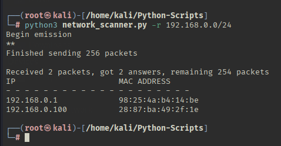

## 🌐 Network Scanner Tool (ARP)


A simple but effective Python network scanner that identifies active devices on a local network using ARP requests. This tool helps you detect live hosts along with their IP and MAC addresses.

## 📦 Features

 - Sends ARP requests to a given IP range  
 - Displays IP and MAC addresses of all responding hosts  
 - Lightweight and fast  
 - CLI-based with user-friendly arguments  
 - Ideal for network reconnaissance and pentesting practice

## 🧪 Sample Output



🛠️ Requirements 

 - Python 3.x  
 - Scapy

## 🖥️ Usage

```bash
sudo python3 network_scanner.py -r 192.168.1.1/24
```

## 🧠 How It Works

 - Sends ARP request packets to the specified subnet.  
 - Collects all responses (i.e., devices that replied to ARP).  
 - Displays a clean table of IP and MAC addresses.

## ⚠️ Legal Disclaimer

This tool is for educational and authorized testing only.
Unauthorized scanning of networks you do not own or have permission to scan is illegal and unethical.

## 💡 Ideas for Extension

 - Export output to CSV  
 - Include vendor lookup for MAC addresses  
 - Add GUI using Tkinter or PyQt  
