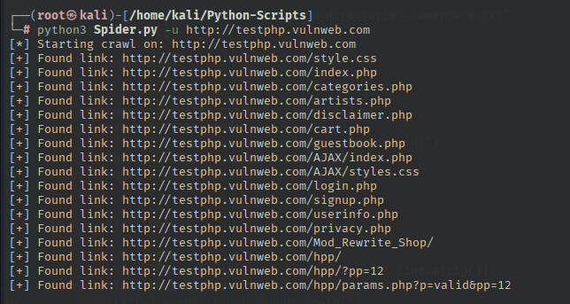

## 🕷️ Website Spider / Crawler Tool

This is a lightweight Python-based web spider that recursively crawls a target website and extracts internal links. It helps in website reconnaissance, link discovery, and vulnerability enumeration by mapping out all reachable pages.

## 📦 Features

 - Extracts all internal hyperlinks from a given URL  
 - Recursively crawls reachable pages on the same domain    
 - Skips duplicates and anchor fragments (#)  
 - User-friendly input via command-line arguments

## 🧪 Sample Output




## 🛠️ Requirements

 - Python 3.x
 - requests

## 🔧 Installation

1. Clone the Repository

```bash
git clone https://github.com/yourusername/web-spider.git
cd web-spider
```

2. Install Required Packages

```bash
pip install requests
```

## 🖥️ Usage

```bash
python3 spider.py -u http://example.com
```

## 🧠 How It Works

 - Sends an HTTP request to the provided URL  
 - Extracts all links using re.findall() for href="..."  
 - Normalizes relative URLs using urljoin  
 - Ignores:  
    - External domains  
    - Revisited links  
    - URL fragments (#something)  
    - Recursively crawls new internal links

## ⚠️ Legal Disclaimer

This tool is for educational and ethical testing only.  
Crawling websites without permission may violate terms of service and legal boundaries.

## 💡 Ideas for Future Features  
  
 - Export links to file  
 - Add depth limit or domain filters  
 - Include option to extract forms and input fields