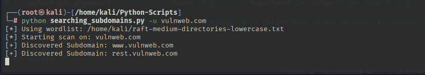

🌐 Subdomain Enumeration Tool

A fast and effective subdomain discovery tool written in Python. It allows you to find valid subdomains for a target domain by using a wordlist-based brute-force approach.  
This is useful for penetration testing, bug bounty, reconnaissance, and OSINT.

📦 Features

 - Performs subdomain brute-forcing using a wordlist  
 - Option to use a custom wordlist or default built-in list  
 - Detects live subdomains using HTTP requests  
 - Simple CLI interface using argparse  
 - Handles errors silently for unreachable hosts  
 - Multi-threaded for better speed (optional extension)  

🧪 Sample Output



🛠️ Requirements

 - Python 3.x  
 - requests

🔧 Installation

1. Clone the Repository

```bash
git clone https://github.com/yourusername/subdomain-enum.git
cd subdomain-enum
```

2. Install Dependencies

```bash
pip install requests
```

🖥️ Usage

```bash
python3 subdomain_finder.py -u example.com
```

🧠 How It Works

 - Reads subdomain prefixes from a wordlist file  
 - Appends each prefix to the target domain (e.g., blog.example.com)  
 - Sends an HTTP request to test if the subdomain resolves  
 - Only prints reachable subdomains

⚠️ Legal Disclaimer

This tool is intended for educational and authorized testing only. 
Scanning third-party domains without permission may be illegal or unethical.
