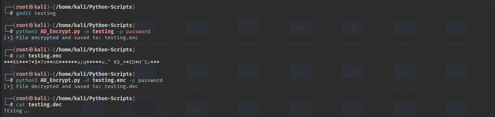

## 🔐 AES-256 File Encryptor & Decryptor

A lightweight command-line tool built in Python that uses AES-256-GCM to securely encrypt and decrypt files. Users pass the file path and a password via arguments. The tool handles key derivation, secure encryption, and proper file output handling.

## 📦 Features

 - 🔒 AES-256 encryption using cryptography library  
 - 🔑 Secure key derivation with PBKDF2 + SHA-256  
 - 🛡️ Authenticated encryption using GCM mode  
 - 🧭 Simple CLI interface with argparse  
 - 📁 File-safe outputs: .enc for encrypted, .dec for decrypted  
 - ❗ Detects incorrect password or tampering

## 🛠️ Requirements

 - Python 3.6+  
 - cryptography library  
 - Install dependencies with:  
```bash
pip install cryptography
```
## 🧪 Sample Output



## 🚀 Usage

Run the script using Python and provide arguments for encryption or decryption.

- 🔐 Encrypt a File  
```bash
python aes_file_crypto.py -e /path/to/file.txt -p yourpassword
```

- 🔓 Decrypt a File  
```bash
python aes_file_crypto.py -d /path/to/file.txt.enc -p yourpassword
```

## 🧪 Example

```bash
# Encrypt
python aes_file_crypto.py -e secret.txt -p mysecurepassword

# Decrypt
python aes_file_crypto.py -d secret.txt.enc -p mysecurepassword
```

## 🧠 How It Works

 - Key Derivation: The password is transformed into a 256-bit key using PBKDF2HMAC and a random 16-byte salt.  
 - AES-GCM Mode: Provides both encryption and authentication. A 12-byte nonce and a 16-byte tag are used.

## ⚠️ Security Notes

 - Never reuse passwords for different files unless you're okay with potential risks.  
 - This tool doesn't store keys or passwords. Losing the password means the file cannot be recovered.  
 - Decrypted files are saved with .dec extension — manage them securely.
